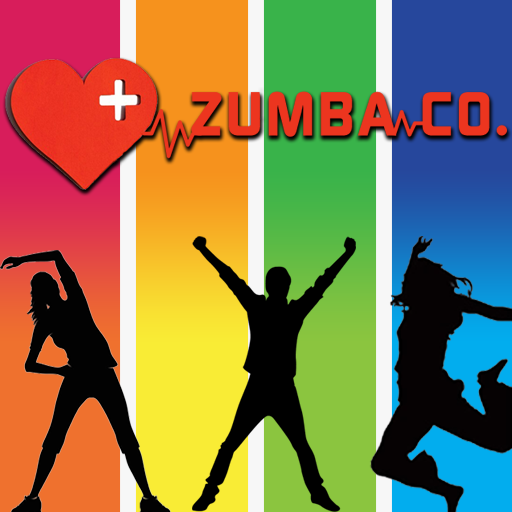

<!-- PROJECT LOGO -->
 

  

<h3 align="center">Zumba Co</h3>

  

Zumba Co was a web project completed for a school assignment. This platform acts as a 
                                            compelling 'proof of concept' for the potential design and functionality of a client 
                                            maintenance web application. It encompasses a multifaceted array of screens, including a 
                                            dynamic home page for company news articles, a comprehensive staff and client maintenance 
                                            interface for effective data management, a statistics page that offers data-driven insights,
                                            and dedicated sections for the upkeep and modification of user account information. 
                                            The primary emphasis throughout the assignment was not solely on delivering a fully 
                                            operational application, but rather on learning to collaborate efficiently within an 
                                            Agile framework with a dedicated team of peers.
     
    <a href="https://github.com/Tipzilla/Zumba-Co"><strong>Explore the docs »</strong></a>
     
     
    <a href="https://github.com/Tipzilla/Zumba-Co/issues">Report Bug</a>
    <a href="https://github.com/Tipzilla/Zumba-Co/issues">Request Feature</a>
  

<!-- TABLE OF CONTENTS -->

  
Table of Contents

  <ol>
    <li><a href="#about-the-project">About The Project</a></li>
    <li><a href="#contact">Contact</a></li>
  </ol>

<!-- ABOUT THE PROJECT -->
## About The Project

<ul>
                        <li>Proof of Concept: Zumbo Co serves as a conceptual model for a client maintenance web application, demonstrating the potential functionality and design.</li>
                        <li>User Account Management: The project features dedicated screens for users to update and maintain their account information, enhancing user experience.</li>
                        <li>Agile Development: The primary focus of this assignment was to gain experience in working within an Agile development environment, emphasizing collaboration and adaptability within a team setting.</li>
</ul>

(<a href="#readme-top">back to top</a>)

<!-- CONTACT -->
## Contact

Hamish Getty - [LinkedIn](https://www.linkedin.com/in/hamish-getty-596894269/)

Project Link: [https://github.com/Tipzilla/Zumba-Co](https://github.com/Tipzilla/Zumba-Co)

(<a href="#readme-top">back to top</a>)

